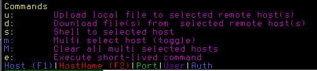

# s1h: ssh + scp + passwords encryption unified in one simple tool

`s1h` is a simple CLI & TUI combo inspired by [K9s](https://github.com/derailed/k9s).

`s1h` allows you to quickly ssh/scp into configured `ssh` host(s). Either via passwords stored & encrypted locally, or by private keys.

## Installation

From go:
```sh
# Install from Go directly:
go install github.com/noboruma/s1h/cmd/s1h@latest

```
Or from the repository:
```
# Or build from the repository source
git clone https://github.com/noboruma/s1h
cd s1h
make build

# You can also install directly using Go
go install ./...
```

Or download the binaries directly (choose your os/arch):

```
# download the binaries from the release
wget https://github.com/noboruma/s1h/releases/download/v0.3.3/s1h_Darwin_arm64.tar.gz
wget https://github.com/noboruma/s1h/releases/download/v0.3.3/s1h_Darwin_x86_64.tar.gz
wget https://github.com/noboruma/s1h/releases/download/v0.3.3/s1h_Linux_arm64.tar.gz
wget https://github.com/noboruma/s1h/releases/download/v0.3.3/s1h_Linux_x86_64.tar.gz
wget https://github.com/noboruma/s1h/releases/download/v0.3.3/s1h_Windows_arm64.zip
wget https://github.com/noboruma/s1h/releases/download/v0.3.3/s1h_Windows_x86_64.zip

tar xvf chosen.tar.gz
```

## Tools Overview

### s1h

The `s1h` tool reads the SSH config file and allows you to select a host to SSH into using either a password or SSH keys.

#### Usage:

```sh
s1h
```
This command displays a list of available SSH hosts from your `~/.ssh/config`, allowing you to select one and connect. It also allows you to execute simple shell commands & scp commands across one or multiple hosts.



Let's image you have the following SSH config file (i.e.` ~/.ssh/config`):
```
Host alive-vm
Hostname ***.**.**.***
User root
IdentiftyFile ~/my-priv-key

Host dead-vm
Hostname ****.io
User root
IdentiftyFile ~/my-priv-key

Host alive-vm2
Hostname ***.***.***.***
User root
```
Simple execute the following:
```
s1h
```


<span style="color:green">Green entries</span> are ssh reachable hosts. <span style="color:green">Red</span> indicates the host are not reachable with the given hostname & port.

You can search hosts or hostname using repectively `F1` amd `F2` to jump directly to entries:


- When you press `s` and it will automatically use the configured authentication method (password or SSH key) to establish the connection. This opens a new shell on the remote host.

- When you press `u` it will give the option to upload a file to one or multiple selected host:


- When you press `d` it will give the option to download a file from one or multiple selected host:


- When you press `m` it will select the current entry for multi selection.

- When you press `M` it will select/deselect all multi-select entries.

- When you press `e` you can execute a simple command to one or multiple selected host.

### CLI mode

On top of password management, it is also possible to use `s1h` as a CLI to shell and copy files.
This approach might be more convenient if you rely on shell history to pass things around.
Mostly this approach helps with password managements.
```
s1h cp [host1:]/path1 [host2:]/path2
s1h shell host1
s1h ip host1
```

### What about password?

The `s1h` tool provides options to create an encryption key and update username-password pairs securely. This is useful for host that requires password instead of a key.
The encrypted file and the key are stored in the `$HOME/.config/s1h` folder, and can be safely transferred across computer. For maximum security, put your key in a different place.

#### Usage:

```sh
s1h upsert -host=<host> [-password=<password>]
```
or
```sh
s1h upsert -host=<host>
Enter password for <host>: <terminal input>
```
This updates the stored credentials for the specified ssh host.
`s1h` comes with other password operations: `reveal` and `delete`.

#### Example:

```
s1h upsert -host=remote-vm -password=mySecureP@ss
# Output: Credentials updated.

s1h remove -host=remote-vm
# Output: Credentials removed.
```

---

## License

This project is licensed under the MIT License.

## Contributing

Pull requests are welcome! Feel free to submit issues or suggestions.

---

**Author:** Thomas Legris

