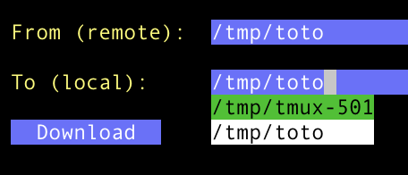

# s1h: ssh & scp in a unified TUI

s1h is a simple TUI inspired from [K9s](https://github.com/derailed/k9s).
This repository contains two command-line tools written in Golang:

1. **s1h** - Quickly SSH/SCP into configured hosts defined in your ssh config file.
2. **passwd** - Manage credentials securely. Used for key-less access.

## Installation

```sh
# Install from Go directly:
go install https://github.com/noboruma/s1h@latest

# Or build from the repository source
git clone https://github.com/noboruma/s1h
cd s1h
make build

# Or install directly using Go
go install ./...

# Or download the binaries from the release
wget https://github.com/noboruma/releases
```

## Tools Overview

### s1h

The `s1h` tool reads the SSH config file and allows you to select a host to SSH into using either a password or SSH keys.

#### Usage:

```sh
s1h
```
This command displays a list of available SSH hosts from your `~/.ssh/config`, allowing you to select one and connect. It also allows you to use scp commands.

#### Example:
```
s1h
```


You can search using associated F1/F2/F3/F4 to jump directly to the entry.


If you press `enter` and it will automatically use the configured authentication method (password or SSH key) to establish the connection.

If you press `c` it will give the option to upload a file to the selected host:


If you press `C` it will give the option to download a file from the selected host:


### passwd

The `passwd` tool provides options to create an encryption key and update username-password pairs securely. This is useful for host that requires password instead of a key.

#### Usage:

```sh
passwd create-key
```
This command generates a new encryption key for securing credentials stored locally.

```sh
passwd upsert <host> <password>
```
This updates the stored credentials for the specified ssh host.

#### Example:

```sh
passwd create-key
# Output: Master key saved to ~/.config/s1h/master.key

passwd upsert remote-vm mySecureP@ss
# Output: Credentials updated.

passwd remove remote-vm
# Output: Credentials removed.
```

---

## License

This project is licensed under the MIT License.

## Contributing

Pull requests are welcome! Feel free to submit issues or suggestions.

---

**Author:** Thomas Legris
**Repository:** [GitHub](https://github.com/noboruma/s1h)

